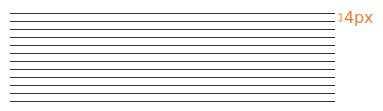

# Spacing

Our spacing unit is derived from our 4px baseline grid.

Any kind of spacing value, be it margin or padding, should be in multiples of 4(px).

## Example

Here's an example of a card structure which fits well with our spacing guidelines.

Additional UI elements, using our spacing guidelines

