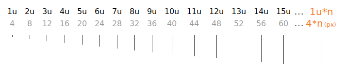

import {
  Reference,
  Property,
  Name,
  Output,
} from '@components/Reference'
import { Spacer } from '@lib'
import Sandbox from '@components/Sandbox'
import Image from '@components/Image'
import SpacingExample from '../../img/spacing-utility-example.svg'

# Spacing

Used to define spacing values

## Custom scale

Our spacing values are derived from our 4px baseline grid. Instead of using pixels, we have defined our own custom units and a new scale. This helps us in abstracting away from the technical details and ensuring scalability across products. 

With our new scale, spacing units are set in multiples of 4 i.e. 1 unit = 4px.

## Usage
Spacing classes take on the syntax of `.{property}-{spacing value}`.
<Reference> 
    <Property>
        <Name> .pt-1 </Name> 
        <Output>padding-top: 4px;</Output> 
    </Property>
    <Property>
        <Name> .pb-1 </Name> 
        <Output>padding-bottom: 4px;</Output> 
    </Property>
    <Property>
        <Name> .pr-1 </Name> 
        <Output>padding-right: 4px;</Output> 
    </Property>
    <Property>
        <Name> .pl-1 </Name> 
        <Output>padding-left: 4px;</Output> 
    </Property>
    <Property>
        <Name> .mt-1 </Name> 
        <Output>margin-top: 4px;</Output> 
    </Property>
    <Property>
        <Name> .mb-1 </Name> 
        <Output>margin-bottom: 4px;</Output> 
    </Property>
    <Property>
        <Name> .mr-1 </Name> 
        <Output>margin-right: 4px;</Output> 
    </Property>
    <Property>
        <Name> .ml-1 </Name> 
        <Output>margin-left: 4px;</Output> 
    </Property>
</Reference>    

## Example

<Sandbox>
    <Sandbox.Preview>
        

        <Image
            imageWidth={620}
            imageHeight={346}
            src={SpacingExample}
        />  
        

    </Sandbox.Preview>
      <Sandbox.Code>
    
  </Sandbox.Code>
</Sandbox>